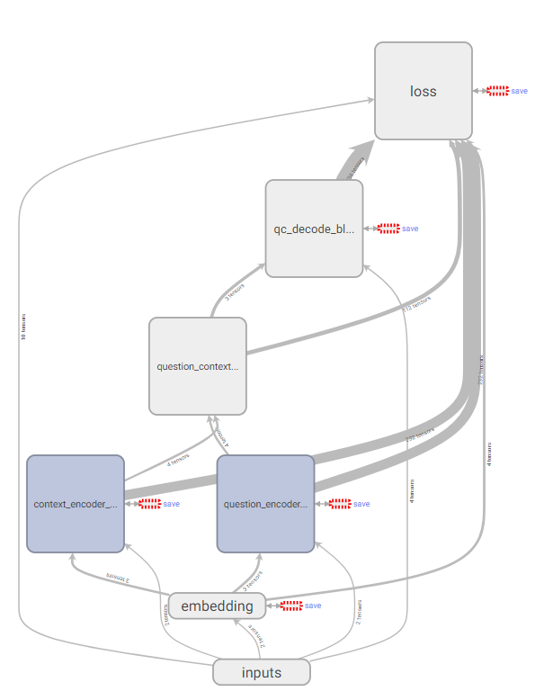
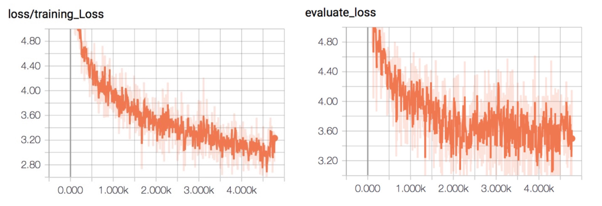

# COMP90042 Web Search and Text Analysis

## Overview

In this project, I build an end-to-end QA system, which takes the plain text of question and context as inputs, and outputs an answer span from the context. I also compare my deep learning based QA system with another IR-based QA system using chunk and NER techniques on developing and test set, the results show that this deep learning based model performs much better than traditional IR approach on the given data set without more manual effort.

## DEEP LEARNING MODEL 

The model architecture is similar to [2][3] [4]. The figure shows the architecture of the neural network, which is implemented in Python using Tensorflow.

Every RNN block is similar throughout the model. A block consists of a norm layer, a bi-directional RNN, and a self- attention layer. After both question and context are encoding by an RNN block respectively, they pass through a coat- tention block, which is used to calculate the similarity on each pair of words from question and context. Self-attention mechanism is also applied inside an RNN block for increasing the weight of important words and decrease those’s which are less important. Then the same block are used to decode the coattention results, and finally they pass to a softmax layer to calculate the loss of cross entropy from start probability and end probability respectively.

After 3 hours training on a virtual machine with a four cores CPU without any GPU resource, the training loss is shown in following plots. Validate loss on developing set is also provided in order to apply early stopping strategy and avoid overfitting.

To make a comparison, I also implement an IR-based QA system using chunk and NER techniques. The following table shows the best F1 score of two models have achieved respectively. We can see that deep learning based QA gets a better performance than IR-based QA on both developing set and testing set.

| Model                  | F1 score (dev set) | F1 score (test set)               |
| ---------------------- | ------------------ | --------------------------------- |
| IR-based QA            | 0.17139            | 0.17422(private), 0.16961(public) |
| Deep learning based QA | 0.51313            | 0.22164(private), 0.24699(public) |

## Reference

1. J. Pennington, R. Socher, and C. Manning, “Glove: Global vectors for word representation,” in Proceedings of the 2014 conference on empirical methods in natural language processing (EMNLP), pp. 1532–1543, 2014.
2. A. W. Yu, D. Dohan, M.-T. Luong, R. Zhao, K. Chen, M. Norouzi, and Q. V. Le, “Qanet: Combining local convolution with global self-attention for reading comprehension,” arXiv preprint arXiv:1804.09541, 2018. 

3. N.L.C.Group,“R-NET:Machinereadingcomprehensionwithself-matchingnetworks,”MicrosoftResearch,2017. 
4. M. Seo, A. Kembhavi, A. Farhadi, and H. Hajishirzi, “Bidirectional attention flow for machine comprehension,” arXiv preprint arXiv: 1611.01603, 2016. 